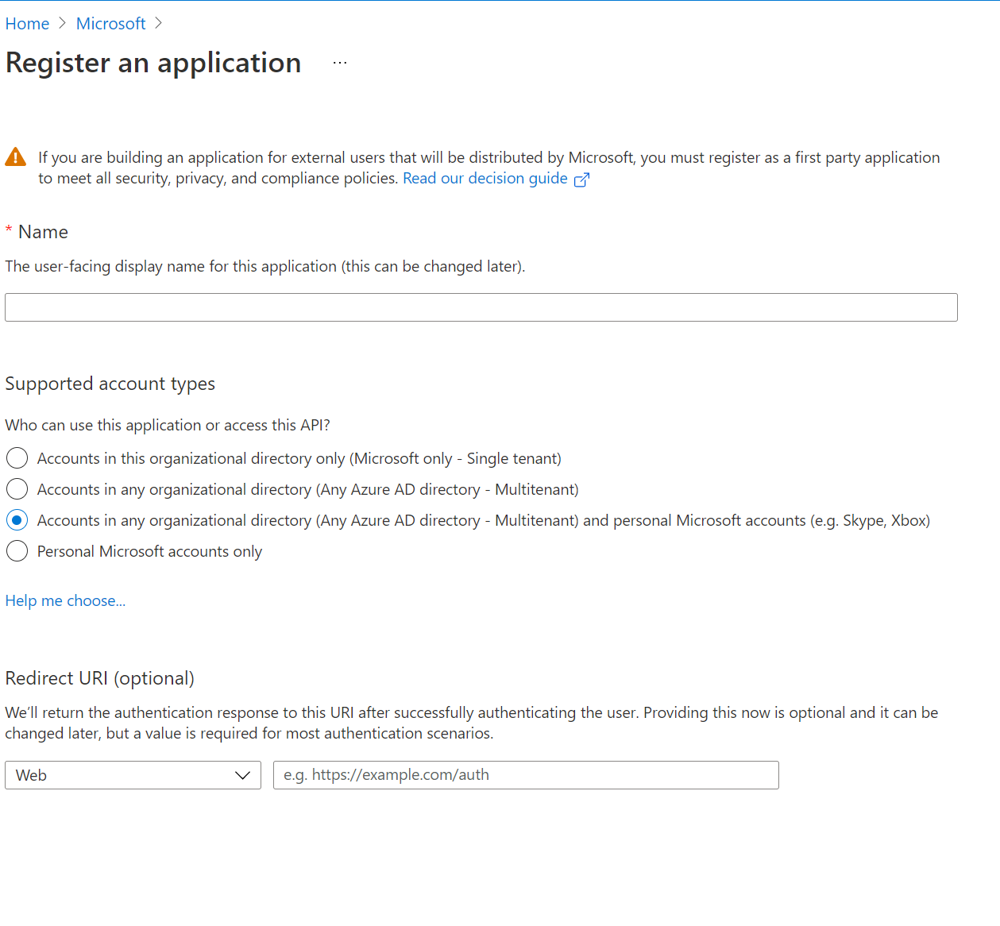
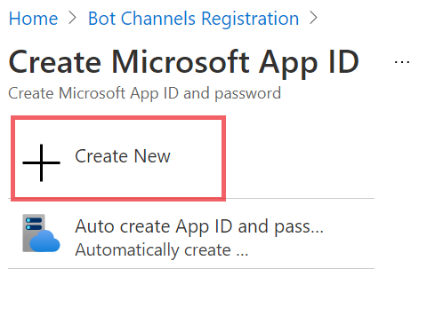
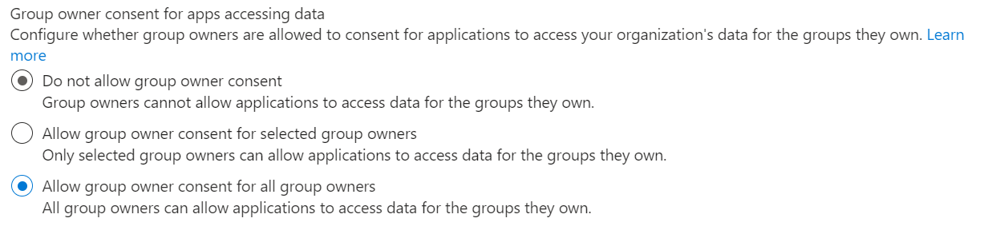
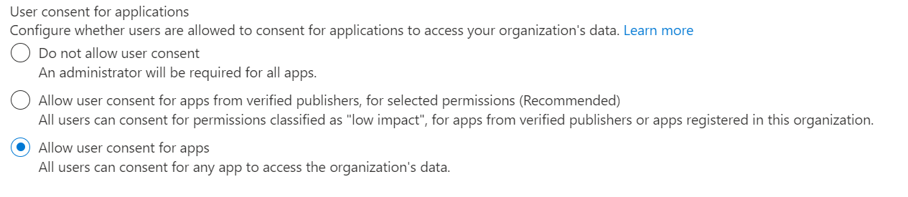

# SecureMeetings

## Summary
It is a good practice to turn off smart home devices/systems (like Amazon Alexa, Google homes, etc) during an online meeting while working remotely. Since these devices continuously stream the audio, there is a potential threat of eavesdropping and leaking information during an online meeting. 
SecureMeetings is a Team's app that notifies users in the meeting to mute or turn off the smart devices/systems. This app send an in-meeting notification/content bubble and an adaptive card in chat that displays the security alert.  
This app can be further extended to take an action on adaptive card to actually turn off or mute the device.

## Prerequisites
- To test locally, you need [Ngrok](https://ngrok.com/download) installed on your local machine. Make sure you've downloaded and installed both on your local machine. ngrok will tunnel requests from the Internet to your local computer and terminate the SSL connection from Teams. 
`ex: https://%subdomain%.ngrok.io` 

## Setup Guide

### Step #1: Create AAD App
- In Azure portal, go to Azure Active Directory -> App registrations -> New registration.
- Register an app.
	- Provide app Name and choose Multitenant. Leave the redirect URI for now. 
	
	- Create Client Secret 
	 
	- Note the Application (Client) Id and Client Secret for further steps.

### Step #2: Register in Bot Service
- Create a Bot Channel Registration in Azure in different tab. Auto create App ID and password 
 
- Create new Microsoft App Id and password. 
 
Fill Microsoft App Id and Password as values of Application Id and Client Secret from Step #1.

### Step #3: Enable resource-specific consent (RSC) in your app
- Sign in to the Azure portal as tenant admin.
- Select Azure Active Directory -> Enterprise applications -> Consent and permissions -> User consent settings.
- Allow group owner consent for all group owners. For a team owner to install an app using RSC, group owner consent must be enabled for that user.
 
- Allow user consent for apps. For a chat member to install an app using RSC, user consent must be enabled for that user.
 
- To understand more about enabling RSC permissions, checkout [RSC](https://docs.microsoft.com/en-us/microsoftteams/platform/graph-api/rsc/resource-specific-consent#enable-resource-specific-consent-in-your-application)

### Step #4: Run the app locally
- Clone the repo  
`git@github.com:shsarda/SecureMeetings.git`

- If you are using Visual Studio
	- Launch Visual Studio
	- File -> Open -> Project/Solution
	- Open SecureMeetings -> SecureMeetings.sln

- Edit appsettings.json file
	- Update MicrosoftAppId/AppId and MicrosoftAppId/AppSecret as values of Application Id and Client Secret from Step #1.
	- Update ContentBubbleUrl `ex. https://%subdomain%.ngrok.io/Notify`

- Run ngrok using the port on which the project is running locally.

### Step #5: Packaging and installing your app to Teams

Make sure the required values (such as App id) are populated in the manifest, Zip the manifest with the profile images and install it in Teams.

### Step #6: Try out the app

- Create a meeting.
- Start the meeting. It should pop-up content bubble in the meeting and posts an adaptive card.

